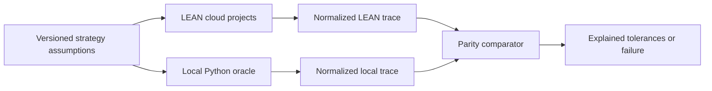
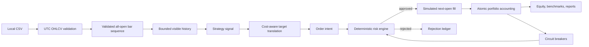
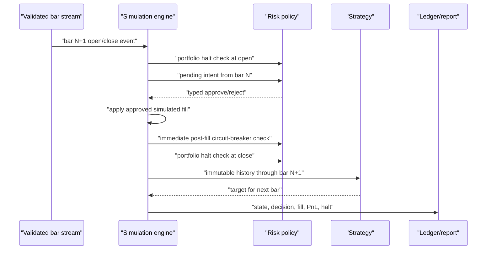
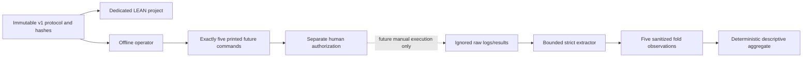

# Architecture

## Active system

The active system has two deliberately independent engines. QuantConnect LEAN
cloud is primary for cross-asset strategy research/backtesting. The
dependency-light local Python simulator remains the deterministic timing,
risk, and accounting oracle.

The two engines share fixtures and output contracts, not fill, risk, sizing, or
accounting code. This preserves the value of an independent oracle.

## Local oracle flow

Batch backtests and historical paper replay both call `SimulationEngine.process_bar`.
The replay layer controls lifecycle and event delivery; it does not duplicate
strategy, risk, fill, or accounting behavior.

## Module boundaries

- `domain.py`: immutable market, signal, position, order, fill, trade, halt,
  warning, benchmark, result, and paper-session contracts.
- `backtesting/csv_data.py`: standard-library CSV parsing and fail-closed validation.
- `backtesting/moving_average.py`: deterministic moving-average and no-trade controls.
- `risk/policy.py`: pure pre-trade and portfolio circuit-breaker checks.
- `backtesting/engine.py`: event timing, target translation, simulated fills, and accounting.
- `backtesting/reports.py`: stable local JSON and CSV schemas.
- `paper.py`: local replay pause/resume/stop/kill-switch lifecycle.
- `observability.py`: size-limited, rotated JSON-lines events.
- `provenance.py`: exact-byte/canonical hashes and path-safe filenames.
- `artifacts.py`: same-directory temporary writes and atomic replacement.
- `cli.py`: typed argument boundary and readable resolved configuration.
- `parity/`: versioned local trace export and cross-engine comparison; no LEAN
  implementation is imported into the local simulator.
- `lean-workspace/Strategies/`: backtest-only LEAN cloud projects with separate
  signal, portfolio construction, risk, and next-open execution components.

Strategies receive an immutable tuple containing only the bounded, processed
historical suffix through the current bar. They return a target-allocation `Signal`; they receive no portfolio,
cash, fill, or broker object. Only the engine can construct an order intent,
only the risk engine can approve it, and only the engine can apply a fill.
The engine also compares protected state across each strategy call and restores
and rejects detected mutation. This guards trusted in-process strategy code; it
is not a hostile-code sandbox.

## State sequence

Circuit breakers latch. Once active, later price recovery cannot resume trading.
Automatic liquidation on halt is intentionally disabled.

The pending target is translated to the largest configured-precision quantity
that stays within the target after projected fees and adverse slippage. The
risk layer then derives and validates quantity, cash, exposure, and post-cost
equity independently. A stricter risk cap rejects rather than resizes an intent.
Peak equity includes opening and closing marks. Start-of-day equity remains
fixed across bars sharing a UTC date and changes only at a UTC date boundary.

## Precision model

The current MVP uses Python floats with explicit configurable rounding: eight
decimal places for quantities and eight for cash/accounting by default. Average
cost uses execution prices. Fees are separate from gross realized/unrealized
PnL; slippage is embedded in execution PnL and reported as an estimate. A future
multi-asset/multi-currency milestone should introduce a reviewed Decimal money
type before adding real settlement or reconciliation behavior.

## ML-ready boundary

`ModelForecast` documents a disabled future boundary for scores, probabilities,
confidence, volatility, regime labels, or target suggestions. The active engine
does not consume this type. Any future model output must pass schema/version,
confidence, freshness, deterministic exposure/risk checks, shadow validation,
paper validation, and explicit human approval before production consideration.
Models must never submit or approve orders.

## Deliberately absent

- Broker/exchange adapters in repository code. QuantConnect API/network access
  exists only in explicit manual LEAN CLI cloud commands.
- Live mode, credentials, withdrawals, leverage, margin, derivatives, or shorting.
- Databases, message brokers, cloud infrastructure, or heavy observability stacks.
- ML training or inference in the active path, neural networks, LLM decisions, or RL.

See ADR 0004 for the shared local event-core decision, ADR 0005 for exact local
timing/accounting invariants, ADR 0006 for Sprint 2 provenance/report/replay
contracts, ADR 0007 for LEAN activation, and
`execution-timing-comparison.md` for the cross-engine boundary.

## Fixed walk-forward validation boundary

Walk-forward v1 adds a third, contract-driven research flow without changing
the local oracle or historical parity path:

Valid private `wf-v1-spy-2021` and `wf-v1-spy-2022` Download Results JSON
files exist outside the repository and must not be rerun. This importer change
performs no cloud work. No operator phase executes LEAN or network work.
`extract`/`aggregate` preserve the canonical-log path;
`extract-result`/`aggregate-result` are separate offline phases for official
Download Results JSON.

`walk_forward/contract.py` validates the canonical manifest, exact five folds,
schema/source/configuration hashes, and fixed settings.
`walk_forward/observation.py` parses one size-bounded canonical observation,
caps total artifact reads, rejects non-regular/link-bearing paths, screens
identity-bearing values, normalizes atomically, and derives an exact-five
aggregate. `walk_forward/result_json.py` independently validates and sanitizes
QuantConnect Download Results JSON, reconciles orders/fills/fees/final position,
and derives benchmark values only from an unambiguous official chart. Operator
writes stay inside the ignored walk-forward report root and cannot replace an
aggregate input. The operator exposes explicit canonical and result-JSON phases;
the default plan is read-only and no cloud-run phase exists.

The LEAN project maps only predeclared fold IDs. It uses adjusted daily SPY,
precise market-close daily timestamps, 50 pre-start warmup bars without
orders/metrics, completed-close signals, and next-open orders. The public dates
are passed unchanged and remain inclusive. Fixed parameters cannot flow from one
fold's results into another, so the workflow is rolling evaluation rather than
optimization. A completed observation is impossible unless LEAN processes the
final eligible exchange close in the public interval; an early stop or trailing
data outage fails closed.

Risk halts latch without automatic liquidation, cancel pending work, and retain
valuation of an existing long. Raw engine artifacts remain ignored; only
separately reviewed sanitized content-bound evidence may be tracked. Runtime
drift is explicit aggregate metadata rather than a hidden pass threshold. No
component promotes the strategy or claims profitability, robustness, paper
readiness, or live readiness.
