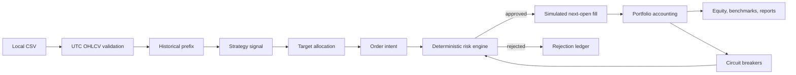
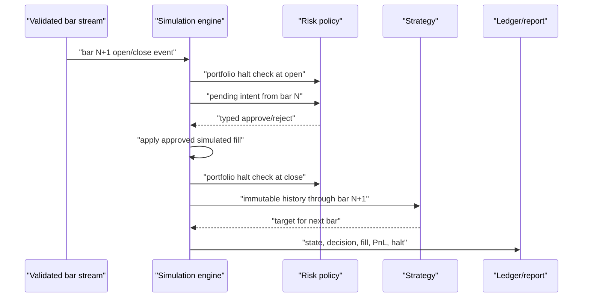

# Architecture

## Active system

The active system is a dependency-light local Python simulator. LEAN is
preserved but paused and is not on the active runtime path.

Batch backtests and historical paper replay both call `SimulationEngine.process_bar`.
The replay layer controls lifecycle and event delivery; it does not duplicate
strategy, risk, fill, or accounting behavior.

## Module boundaries

- `domain.py`: immutable market, signal, position, order, fill, trade, halt,
  warning, benchmark, result, and paper-session contracts.
- `backtesting/csv_data.py`: standard-library CSV parsing and fail-closed validation.
- `backtesting/moving_average.py`: deterministic moving-average and no-trade controls.
- `risk/policy.py`: pure pre-trade and portfolio circuit-breaker checks.
- `backtesting/engine.py`: event timing, target translation, simulated fills, and accounting.
- `backtesting/reports.py`: stable local JSON and CSV schemas.
- `paper.py`: local replay pause/resume/stop/kill-switch lifecycle.
- `observability.py`: size-limited, rotated JSON-lines events.
- `cli.py`: typed argument boundary and readable resolved configuration.

Strategies receive an immutable tuple containing only the processed historical
prefix. They return a target-allocation `Signal`; they receive no portfolio,
cash, fill, or broker object. Only the engine can construct an order intent,
only the risk engine can approve it, and only the engine can apply a fill.

## State sequence

Circuit breakers latch. Once active, later price recovery cannot resume trading.
Automatic liquidation on halt is intentionally disabled.

## Precision model

The current MVP uses Python floats with explicit configurable rounding: eight
decimal places for quantities and eight for cash/accounting by default. Average
cost uses execution prices. Fees are separate from gross realized/unrealized
PnL; slippage is embedded in execution PnL and reported as an estimate. A future
multi-asset/multi-currency milestone should introduce a reviewed Decimal money
type before adding real settlement or reconciliation behavior.

## ML-ready boundary

`ModelForecast` documents a disabled future boundary for scores, probabilities,
confidence, volatility, regime labels, or target suggestions. The active engine
does not consume this type. Any future model output must pass schema/version,
confidence, freshness, deterministic exposure/risk checks, shadow validation,
paper validation, and explicit human approval before production consideration.
Models must never submit or approve orders.

## Deliberately absent

- Broker/exchange/data-vendor adapters and network calls.
- Live mode, credentials, withdrawals, leverage, margin, derivatives, or shorting.
- Databases, message brokers, cloud infrastructure, or heavy observability stacks.
- ML training or inference in the active path, neural networks, LLM decisions, or RL.

See ADR 0004 for the shared event-core decision and `lean-paused.md` for retained
LEAN status.
